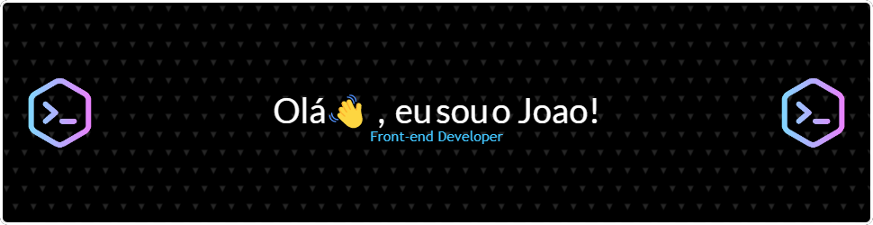

👋 Hello, my name is João Gabriel, I'm a **Front-End Developer**.

🌱 I'm always studying **HTML**, **CSS** and **JavaScript**.

✈️ I currently work with **IT Support**.

⛹️ Developing a **large portfolio** to get to know me better...

🎯 Focused on learning **TypeScript** and **NextJS**.

🔭  See a little more about me...

  <a href="https://www.instagram.com/o_joaozx/" alt="Instagram" target="_blank">
    
  
  

